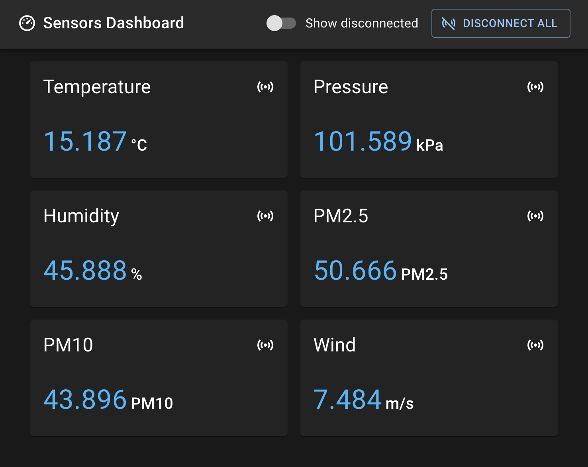
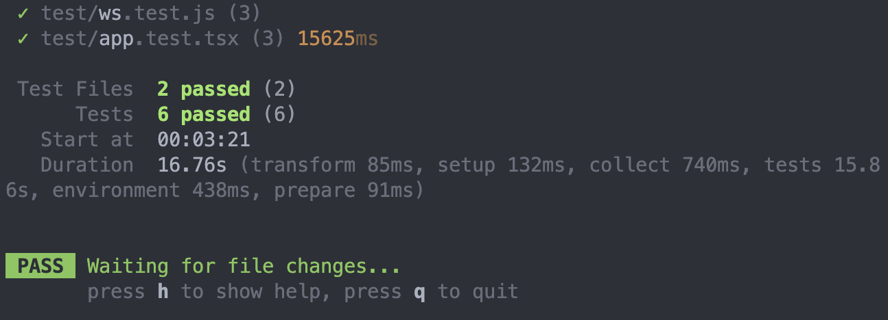

Example of a front-end UI displaying various Internet of Things (IoT) sensors based on data provided through a Web Socket endpoint.



The UI shows the sensors with their current state, and users can connect and disconnect them. There is also a possibility to toggle whether to see all sensors or only the connected sensors.

This example is focused on being done quickly, so it uses MUI as the library for the user interface components. The state is managed with Redux, and the connection with the server is done using a Redux middleware which directly updates the state as soon as new data comes in.

### Running the example

Start the server with:

```bash
cd server
npm install && npm start
```

Start the client with:

```bash
cd client
npm install && npm start
```

The server port can be changed changing `VITE_SERVER_WS_URL` in the `.env` file.

To run the tests:

```bash
cd client
npm run test
```



The tests are going to automatically spawn the server at port 5000. Make sure to not have any other process running at this port, and to quit correctly the tests with `q` to correctly shut down the server.

### Interesting parts

The most interesting part of the exercise is to architect the WebSocket connection as a middleware, with connection and re-connections in case of server goes down, recovering the connection status of the sensors.

Another interesting part is to make sure that only the right components get updates at a data change. This means making sure the data is normalized and using Redux was also crucial for this purpose. Having a custom hook to maintain the WebSocket connection was another possibility, but a bit less clean in terms of architecture if we thought that this would be part of a bigger application.

### Cumbersome parts

I believe the middleware implementation in Redux has its flaws in terms of how it's required to be implemented. Redux Saga seems better in this regard, but with its downsides too.

### What can be improved

I believe the user experience here can be improved by establishing what are the typical ranges of values of each sensor and having a graphical way of representing when it's too low or high, possibly in a more graphical way with plots. Throttling the values displayed can also make it run the client a bit faster.
